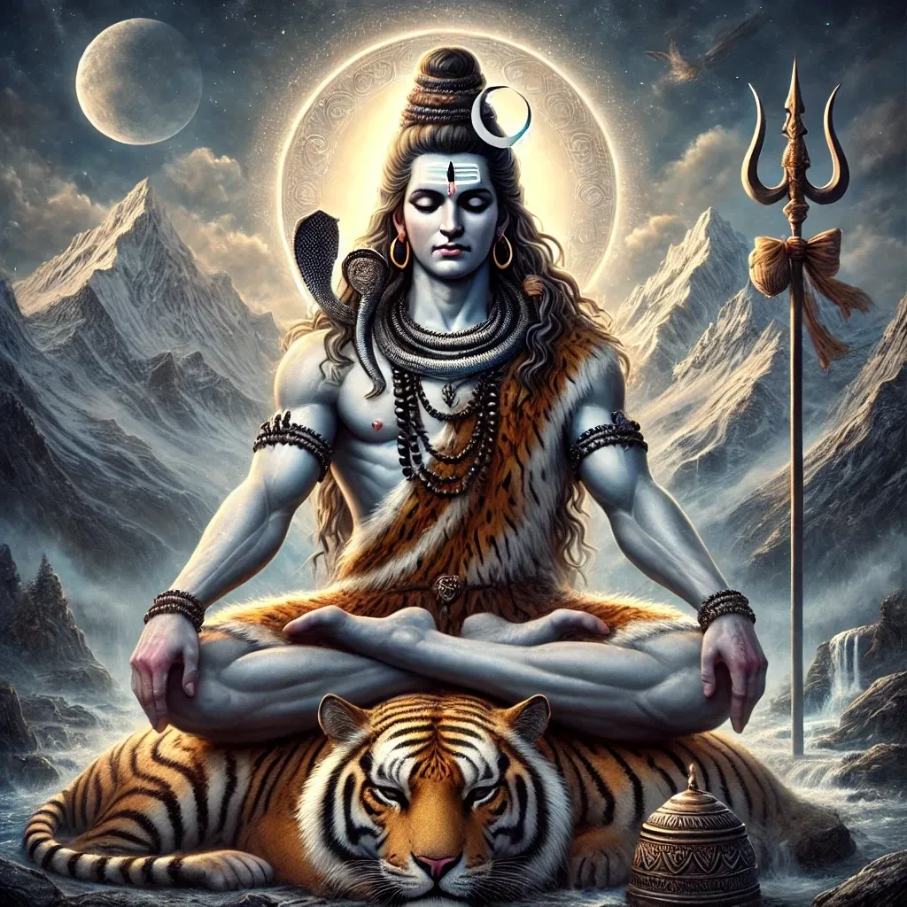

Lord Shiva, Patron of Transformation or evolution. For yogis he represents the *inner* transformative power - the ability to dissolve ego and ignorance to realize the higher self and to be at peace within and as part of the whole. The yogi comes together and meets with wih everything.

## Grain of Truth (and Beauty)

>अगर भीतर शांति हो, तो हर चीज़ से मिलना सहज होता है।
>*Agar bheetar shanti ho, to har cheez se milne sahaj hota hai.*
>
>If there is peace within, then meeting everything becomes effortless.

We are born heralded; an innovation from the well-spring of culture and into the structure of family and community: the foundation of all civilizations. The moment of conception begins the blush of anticipation; what young idea will his fresh third eye bring to our semi-charmed lives to end the futile pursuit? What blind aimlessness will they in some almost imperceptible way will they set right. What grain of truth will be grist for its mill to divine and make beautiful? Will the child be a *Milne* who spins energy for a true creative purpose or the rentier and speculator who exploits and trades on his talents on the markets? 

**HERE**

 'milne' (मिल्न) phonetically means, in an abstract sense, to 'come together' or meet - whether it be to break bread within one's community of friends and partners in life or to conduct an atomic transaction for due consideration with a stranger. On a spectrum those are the extreme two bounds within which parties exchange value, and are then over time imbued with a notion of relative *trust* as they manage their affairs in a social network, digital or otherwise.

My given name, is Indo-Aryan Sanskrit - Ashit अशित). It denotes the immaterial yet desirable. That unfrozen (warm) space, our planet, which has allowed consciousness to evolve, and through it truth to be known over time; allowing ultimately for the end of ignorance (below). The notion is made real on this planet - Earth - which yields comfort for humanity. Ashit Milne therefore means 'The Planet Come Together'. It reverberates with anarchism - the world is our country, to do good is our religion.

Whatever I am to the world, I call *myself* Ashit Milne. 'Milne' suggests a hewer of wood, drawer of water, and a grinder of grain with which to bake bread. My maternal grandfather was a Milne of sorts - operating a saw mill and workshops building Modern Furniture (he had some vision, for that was literally the name of the company he founded) for the Modern English of British East Africa (Kenya, Tanzania and Uganda). The name though is Scottish in origin, and so perfectly suited to modulate and balance my sheer Englishness (I have yet to set foot in Scotland or Wales - never mind Ireland). I came of age as walls came down, save one on the island, I was born. Hadrian's that metaphorically only, of course, needs to fall for genuine home country reconciliation. The name also brings me myself full circle and home to my adopted country Canada - British North America. If that seems too serious and self-important then forget poetry and foreign languages for a moment and stick with English.

There is a nuance with modern English that non-native speakers find bewildering - even the fluent. For example,  do you apprehend the truth carried on the Christ's breath in the cockney turn of phrase above? And does it imply the Creator's wrath or his benevolent kindness? You cannot know without direct personal experience of his countenance (as *He* offers you a nod and a wink).

A. A. Milne is a creator of a world with an *assorted mess* of odd characters who appear to have free will - the agency to do as they wish - but who never truly *come together*. They are a pluralistic 'mess' of personality types who cannot join in the communal 'mess' hall to break bread and so they are sorted into relative isolation that is not quite *enough* to allow true lasting contentment. An air of melancholy pervades the stories of Winnie the Pooh and his friends because, you and I know they they are unnaturally gentle creatures but shorn of even that natural instinctive need for pack or tribe. Even Kanga's guardian is a unnamed single mother. There is no Regnum Dei (Kingdom of Heaven manifest on Earth) here. An ever repeating cycle of positive emotional and spiritual sum through consensus is impossible in Milne's 100-acre wood. There will never be a coming together here for it is not so much a bittersweet symphony of life but rather the unfinished one of infantile and arrested development.

Milne's world is an allegory of our modern humanity (such as it is); we have become a litter (basket case) of types sorted into compartments contented *enough* to exchange the odd greeting as we pass one other in our lanes, each of us trapped in a state of imaginary grace. We're alive and kicking in fits of 'dappy happy', curtailed though, is our sense of truth and trust. This is not the promised salvation of philosophical liberalism that I dreamed of as a youngster. It is self-evidently incomplete, and for an unlucky few who are privileged in all the wrong ways - that is to say granted liberties (over themselves or others) that they cannot manage -  it is isolation, desolation, alienation and self-destructive self-indulgence in excess. They are oblivious of the burning beds they have made and have made others lie in - and our passive acceptance makes the rest of us complicit.

I am however capable of a little humour and self-deprecate for a moment. For me Donegan's illustration (below) adds comic relief and the reminiscences of growing up with a *distinctive* name. Within the confines of his 100-acre wood Pooh at least feels secure enough, whereas who know what sadness, cruelty, and bully hurt lies beyond it. The wood is a place of sanctuary (it is not nothing) from which we have an opportunity to contemplate and enable our collective intellectual property (*Deus In Machina*) to calibrate  closeness and find love - not just the love we need but that which the essence of life actually demands that we must *have*  - the ecstasy and rapture of union to procreate ones who grow to perceive pure devotional love in their parentage - giving them faith and hope for the future. It is the promise of both the New and the Ancient Jerusalem and of both Modern English and Mythical Eden: Paradise with neither trespass nor even the temptation of it.

Dream of better lives the kind which never hate, Trapped in the state of imaginary grace, I made a pilgrimage to save this human race, Never comprehending the race had long gone by,

I'll stop the world and melt with you, You've seen the difference, And it's getting better all the time, There's nothing you and I won't do, I'll stop the world and melt with you,  

Modern English ([*Melt With You*](https://www.youtube.com/watch?v=LuN6gs0AJls))

I was in High School when that song topped the charts and I'm not always entirely sure that things are still getting better all the time. At any rate, we have no cause to be complacent and nothing to fear from a transparent and true reckoning of what we hold - if we are to carry our human tribe forward with any degree of confidence in a safe pair of hands. 

Edit Image

**Identity Access management**

I am, I am, I am *Superman* and I know what's happening I am, I am, I am *Superman* and I can do anything

~ R.E.M. succinctly reference Nietzsche, identity and self-sovereignty *(I am Superman*)

Oh, and that name I carried beyond my own private little 100-acre wood? To the world beyond my Government Issued ID, I was 'Asheet' or 'Ash'. I had become equivalent to my notional 'paper' value literally. What are you worth and what is the value of your flags, contracts, promissory notes and paper money? I have had to ask myself 'Are you just '*a sheet'* until the world reduces you to *ash* or would you prefer to represent the whole self as your namesake *the planet - creation itself?* I answered by tearing my Birth Certificate (below) into shreds. I prefer Pooh's dignity honey, Londinium (above) - now *that's* money. The document had been remarkably well-preserved to that point.  I am not 'a sheet' created by His Majesty's Government. I threw the pieces into my woodstove turning it to 'ash' without ceremony. How far will you go to affirm your sovereignty? I turned 'a sheet' to 'ash' symbolically and materially so that I could come full circle and begin again as *Ashit Milne* the 'planet come together'. You cannot fault me on ambition, creativity or symbolism; I am Shiva, destroyer of a sheet (and a creator of a new  order, at least in the 100-acre 'would' of my own mind). You know my name (if you didn't before). It's Ashit Milne.

Edit Image

**Is God Bollocks or the Dog's Bollocks?**

God gave a shit because he took a shit. For God giving and taking is one - the constant transmutation of energy and matter - the constant [g]astronomical churn of creation and destruction that sustains us. Is that really so blasphemous? Humanity looks out at the void of space from the planet and wonders with the misapprehension of dyslexic hubris 'Is there a Dog?' There's 'out of the box' thinking for you! (The planet isn't in a litter box after all - so it's definitely not a cat). I would prefer to be called an atheist than quibble as you argue and wage war about the nature of nature's affiliation. Do see Matt Damon's character in *The Martian* Mark Watney trading a shit for a dollar as he coaxes life out of his barren planet?

Here's the thing with money. You don't make money. *You save* it - it's what's left after you successfully managed to subsist*.* Ideally it's that finest currency of all - time - with which to do whatever you please. If something is money it's because it has *yield -* time well spent in hindsight is self-evidently productive - it makes you feel good; and if you have something of value which generates yield, you don't bother trading it for the notional token denoted by the sovereign (hegemon or otherwise) *ever*. It is why, as capital, I hold property (it yields among other things its own heat, cooling and electricity), a couple of cords of firewood, Ethereum and Solana. I am technically short fiat  - some would say I'm overdrawn and mortgaged - but I say I'm 'short fiat'. 

And what value do I assign to myself? I am no longer of the Patel caste - or any caste for that matter; through diffuse behaviour I have become the boundary without affiliation within which all is held and witnessed; the untouchable edge where shame and innocence are indistinguishable. The seer *apprehends* without reservation, resistance, and without judgement until he has seen all he needs to. Then there within the boundary framed by all, lies the infinitely divisible and disparate behaviour where we each find ourselves and know the other so that by discovering our Call to Adventure, and combine with partner, family, community (culture) to create something meaningful in the world.

What I have discovered this passed half century is that if I give Ashit (myself) to rest of humanity, it will take - and keep on taking Ashit. Is that really enough for you? A regular bowel movement pun - is that the limit of your self-absorbed imagination humanity? 'You have the children and educate them, keep your parents in their old age, compost, recycle, even manage your septic waste because *you're* Ashit and I quite simply am not. I'll be sure to take my Metamucil, my other supplements; my 'free' dental and medical care too and then I'll retire early on my pension (the ones your kids will pay for with their taxes) in this great white liberal paradise' (no reservations required for clean drinking water)*.* One can only laugh: What a piece of work is man! How Nobel Prize winning its infinitely tenured faculty and administrative staff!

**Abomination of Obama's Nation**

Colin Powells, Austin Powers Lost in translation with a whole fuckin' nation They say I was the abomination of Obama's nation Well that's a pretty bad way to start the conversation At the end of the day, goddammit, I'm killin' Ashit I know damn well y'all feeling Ashit I don't need your pussy, bitch, I'm on my own dick I ain't gotta power trip, who you goin' home with? How 'Ye doing? I'm surviving I was drinking earlier, now I'm driving Where the bad bitches, huh? Where y'all hiding? I got the power make your life so exciting  ~ Ye ([Power](https://www.youtube.com/watch?v=L53gjP-TtGE)) 

By 2007/2008 as value broke decisively in the world amidst the great financial crisis, I had begun to lose my persona or rather I had begun to surrender it completely - using it to define both subject and object as I explored non-duality in spaces both conventional and unconventional. At work I leaned in real hard, impressed, burned out, checked out, and then predictably disappointed my bosses in a Career Groundhog Day doom loop. It was at our IBM offices at 120 Bloor East that I sat at the kitchen counter with *de rigueur* Foosball, Ping Pong tables, and bean bags in the lounge behind me (when did accountants stop counting beans?) There I watched on the large screen the unfolding cover-up known as TARP (Troubled Asset Relief Program). Watching TradFi getting bailed out again and feeling deep disillusionment, I found solace and tranquility in a warm quiet space where I could meditate in movement amidst community. I had developed a solo practice in the Ashtanga Vinyasana tradition at home since 2000 as a mode of meditation. I used the internet to find community and even the thrill of attraction as I blogged in a group of Ashtanga practitioners, under the name 'Yogi One Can I Be'. 

Now I wanted something more tangible and seeking a tribe amidst the turmoil of 2007 I arrived at Toronto's renowned Downward Dog on Toronto's Queen Street West to train under the guidance of a genuine seer (Ron Reid). I'd seen him once among a throng at the Toronto Convention Centre years earlier when I volunteered to help out at the Toronto Yoga Show and felt drawn to towards him; 'That's my Father of Yoga' I thought as I watched him in conversation with a crowd exuding a chill, contemplatively quiet and positive vibe. I had already begun to complete an unravelling - a final razing to the ground of an unstable foundation built up over years. It had me spinning as I came to grips with my name and it's *intended* meaning. 

All I have is all I need Enough for love but not for greed, yeah I was younger once, this guy came to me Told me about all, the honey out there He said, honey, gold, jewels, money, women Wine, cars that shine I don't know what he was talking about But I think, I had an idea

\--

He said, smell the rose, sweet, sweet rose Catch the sun, find where it grows Smell the rose, the sweet, sweet rose That grows on castle walls in heaven In heaven, yeah

\--

Hey dude, don't lean on me, man 'Cause I'm losing my direction And I can't understand No, no Hey dude, well I do what I can But you treat me like a woman When I feel like a man

~ Kula Shaker ([Hey Dude](https://www.youtube.com/watch?v=KDHd-vxcMDo))

**Monetary Monism Manifests**

I was at the studio for a couple of years and found myself belonging to the space so I entered their teacher training program. At the same time I had my eye on evolving technology and its implications for Yoga in the esoteric sense; it was the emergence of virtual architecture - the algorithmic logos, as yet underdeveloped for the humanistic and intuitive ethos of aligning self-interest to the Universal.

In instead of renouncing technology for Gloopy 'poses for dollars' I began to think again about money as a technology - its use cases - and almost intuitively too, turned to 'bare apeness' (learning how to live with and on the planet in stillness even at speed) - a related practise for what else is money but an abstraction of capital from specialized work (movement and thought) on the planet? In any case my disenchantment with the narcissism of asana practice was complete and I began to drift away from the studio as my work took me to first to Scarborough (Telus) then Kitchener (Manulife), far away from Emma's neighbourhood. But how many of her anarchist particles did I inhale with those years? The monism of my practice was beginning to see the light of day on earth as money in our political economy and it had my attention. The esoteric meaning of Good and God (Heaven) is upon us on Earth, if we have the vision to see it: *Thy kingdom come; thy will be done; on earth as it is in heaven* 

Ten years on, I find direction, purpose and meaning recollecting my connection to a tribe of people with whom I developed some affinity and love with in that turbulent time. As central as it was to the studio's lifeblood, more than becoming blessed with a bucket of lucky mobility, it was relearning what it meant to love without possessing or being possessed; feeling non-duality towards *another* if not all others - to love and let leave. Like an image reflected in a black mirror that gained the light of clarity over the years, I began to see the man I started to become and am now in that space and in that time - *Ashit Milne -* the personification of a planet come together.

**The Binding Pose of Fatherhood**

I return to A. A. Milne's stories one last time for they have have been an ever-present facet of my daughters' coming of age and since now, I am A.A. Milne. Being a father required me to continue being 'Ashit (Ashvinkumar) Patel' for some time yet - I had two daughters, Dhara (*flow or* *currency*), Diya (*illumination*) while a third, Drishti (*vision*), was due in 2009.

My own remaking as 'an A. A. Milne' would have to wait for over a decade while I watched the original's work reimagined by Disney with my daughters. The price a parent sometimes pays is wage labour in the world - one can only hope that it offers insights as it did for me. In any case I reckoned I didn't yet have the freedom to do whatever I wanted. A salary at least affords you the opportunity to bring the 'living colour' of small material comforts that delight your children. I recall taking my eldest, Dhara, to Piglet's Big Movie, in 2003. She was so small that her feet barely dangled off the seat and I had to place my hand on a corner of it to keep it from closing back upon itself turning her into a taco. I still recall an ominously dark and violent scene - a storm - as Piglet held to a branch protruding from a cliff face swaying in the gale. My daughter turned to me, mouth contorted with anguish, eyes welling with tears to ask 'Is Piglet going to die?' I smiled, even chuckled and shook my head - I turned and behind us a mother watching the film with her son gave me an 'Awww she's so cute!' look. Dhara turned back to the screen warily, not quite completely convinced by my assurances, mouth-breathing, and wiping away tears with the backs of her tiny paws. 

Edit Image

The real Winnie, a native of Winnipeg, the longitudinal centre of Canada, made his way to my hometown London to live in its zoo where A. A. Milne happened upon him. I travelled the other way, from London, arriving aged fourteen with my parents in 1983. It was in Toronto, Canada's largest city, where I came of age and where I then settled into the roles of husband and father.

Dhara was my millennium trick and treat combined - born on April Fool's Day 2000. That summer after we watched Piglet and Pooh on the big screen I took her to London's famous Hamleys, scarcely an hour's walk from Winnie's old digs at the London Zoo, so that she could have a bear custom-made precisely to order - hers to hold tightly for comfort. She's 23 years old now; a graduate with an Engineering degree from my own [UWO](https://www.uwo.ca/index.html). I will leave to fate (Modern English, Mythical Eden - and all that is in between) the task of delivering to her the ideal *animate* intimate to hold in a long embrace.

**Planet Come Together**

In Japan, a finishing school that polished me the best it could before handing me back to Canada to assume the responsibilities of career and home, there's a tradition demanded of some men: Adopting another's name to extend its lineage. Ashit Milne has become my *nom de guerre* and since I wage war by other mean (love), it is rather, my *nom de plume*. I may even in good time, make it my name in law. Ashit Milne or 'Planet Come to Together' encapsulates a philosophical ideal I dare not label as anything other than anarchy. In that Yoga Studio in those heady days as our money began to find its journey towards dignity I introverted but my *drishti* fell upon a Milne and I've taken her name to direct my train in vain. To find direction much like a weather vain on the Christ's breath. Only a word or two from her sufficed to turn me right side up and then driven with clear intention; to do good in my country with my Calling.

 सत्यम् शिवम् सुन्दरम् - Satyam, Shivam, Sundaram - *truth divines beauty divines truth divines beauty*...