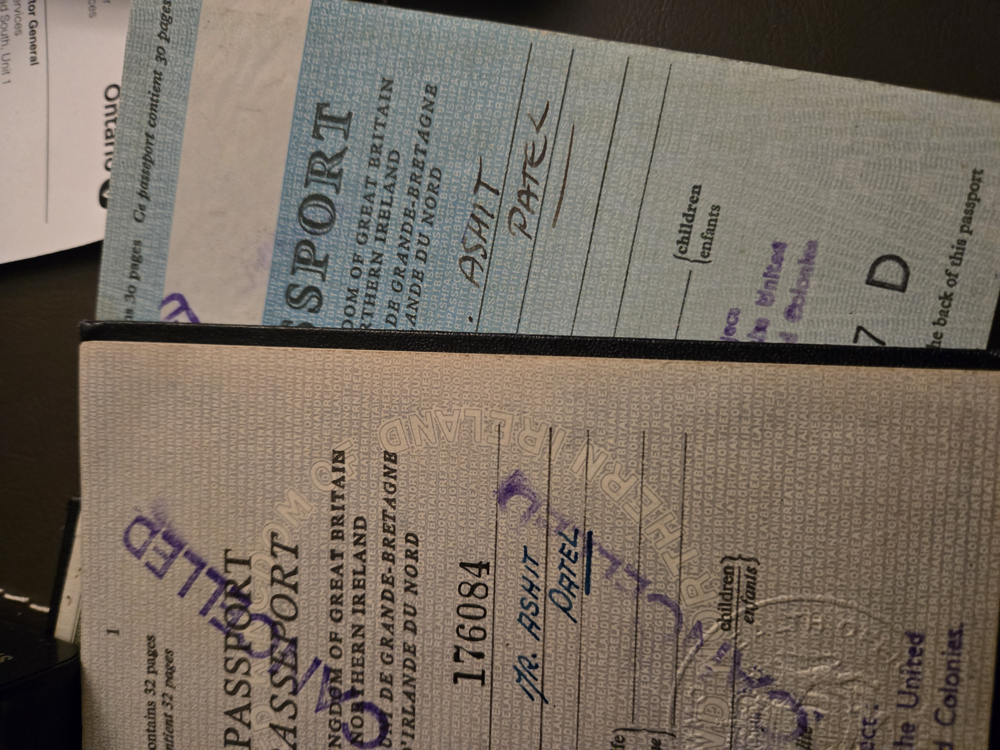

Above: My first passports. The clerks at the offices in London made sure to underscore the message - I was A Tel - reminding me that I was born a free man - Mister Patel, the Indian in a brave's New World to become hopefully *mishpat* (מִשְׁפָּט) and *tel* (תֵּל) and amount to something legitimate from London's New Ham - amidst a 2000 year-old mishmash (מִישמַאש) in turn both profane and profound since the Roman lay the first of a 'ton of stone' on the banks of the Thames (in Leytonstone). I might have forgetten myself in the coming chaos and turmoil of a tumultuous century's turning had those those clerks not be so judicious in reminding me I was 'a tel' carried from continent to continent to continent to, yet another continent, across three generations. Surely I had something to say about our modern interstitially complex reality.

> There's a destination a little up the road
> From the habitations and the towns we know
> A place we saw the lights turn low
> The jig-saw jazz and the get-fresh flow
> Pulling out jives and jamboree handouts
> Two turntables and a microphone
>
> ~ Beck (Where It's At)

## Inhabit ##

>What befalls each man has been ordained in some way as conducive to his destiny. For we say that things *fall* to us as the masons too say that the huge squared stones in walls and pyramids *fall* into their places, adjusting themselves harmoniously to one another in a sort of structural unity
>
>~ Marcus Aurelius, Book V, 7

A Tel is a hint passed through time by the virtuous. It comes from the Arabic تلّ  and the Hebrew תֵּל, both meaning "mound." It is an artificial hill formed by layers of human effort over centuries. These mounds accumulate as older structures are built over and compressed; a literal stratification of history these tels are the civilizational stone roses. The slotted together aspects of a culture that may be deciphered by archeologists and anthropologist who want to understand what it is precisely that a people *valued* (and so, kept). The arteries leading up to these mounds carry the lifeblood or redcurrant that makes these mounds whatever they are. The distilled value deemed worth carrying home came from places and people we feel a connected. As  well in the end we're all on the same material plane and made up of those ordinary elements of the planet. 

In my mother tongue (the first language I learned as a young child) Gujarati, the word તેવ is pronounced 'tel' in the cockney I'd ingested on the streets of East and North London. It was slowly exorcised by years of elite education in England, India, Canada and Japan replaced with a vaguely academic Trans-Atlantic stream of an accent that drifts this way and that. In any case *tev* means habit.

We inhabit our bodies and in habit we manifest personality through action. We ourselves are a mound of habits carefully tended by our family and community. Equipped we reach into the greater realm of the prevailing structure under the guiding hands of teacher and mentors. Each of us an innovation of that structure looks upon the time-worn unquestioned and familiar ways of the world. We set upon the best of those ideas and make them our own. *Their* careful assembly is what make us *semper idem* in civilization and even beyond - within creation; each of us is a Dial Square sundial situated alone in space and time with an entirely unique perception of reality. From that perspective, in time, having risen stone by assembled stone as an instance of humanity, with both gratitude and courage (for we are speaking out of turn perhaps and impertinently) we offer *the young idea*; the beauty yet to milled from a grain of truth; that 'just is' not yet justice.

Who we are in words and action amounts to a semantic perimeter of identity embodied; a new and use-case specific chip off the *old* block. One which innovates or learns and so constantly evolves to approach a perfection in the distant event horizon of our lifespan. The mound of habits, the currents of culture that appeals to us and a sense of connectedness to all things.

I express that idea using three aspects of culture from the twentieth century that I came of age in: Popular music, professional sport, and the *whole damn thing that I call yoga*. Besides, what else exemplifies the coming together of east and west and the integration of the planet's culture than the mania in *yogasana* which went viral (before that was a thing) at the end of last century? They had come together in a bespoke fashion to define a perimeter; a porous, rewritable but fully possessed chalk circle - that is to say, well enough defined and open to continued development.

By 2008 I was beginning coming together; to turn towards the full circle home to being the complete me: I began to understand what I valued irrespective of social norms. Lines between work and play began to blur to make whole the severed packages that we present ourselves in order to fit into different parts of a world that struggles to live with itself. I continued awhile in these compartments still not yet quite yet come together. Not definitively and irrevocably. I would still be 'Ash Patel' for a while.

