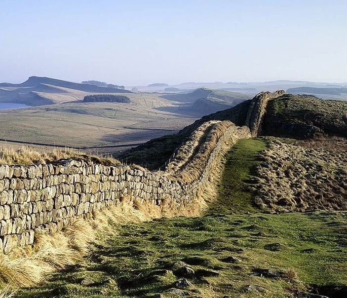

## The Eye of Your Mind

>Slip inside the eye of your mind
Don’t you know you might find
A better place to play
You said that you’d never been
But all the things that you’ve seen
Will slowly fade away 
>
>~ Oasis (Don't Look Back In Angel)

A decade ago I rode my motorcycle west towards Campbellford and nearby Ferris Provincial Park. It was to apprentice over a weekend with a craftsman who was practiced in building dry stone wall (made without mortar). I and several others formed an ad hoc community complete with the quiet gentle banter of peaceful humans capable of heavy lifting getting to know one another whilst engaged in the task: A meditative practice that involved the collection of whatever pieces of stone, small and large, that lay in our immediate surroundings to create a wall with contemplative deliberateness. If you took a cross section of that wall or opened it up to examine it, you would find deep compact, almost interlocking substance. Larger pieces on the outside leaning inwards as the wall rose with layers of progressively smaller pieces, right down to the size of pebbles, within. They fitted like jigsaw to rest against and upon each other. The interior resembled a bed neath a crystal clear stream. 

Intention and the willingness to invest the time required is what makes these walls resilient and elegant. That is why so many of them across the old world still stand - they are cherished; One, Hadrian's (above), continues to stand, at the boundaries of Rome's old empire; so too the roads they built again of stone some of which are still in use; they radiate across England from London (once Londinium). Walls and roads such as these have a purpose that can bring us together beyond their immediate purpose. Even barriers have a constructive purpose that may have nothing to do with the delineation of property and ownership - leave alone Empire - as I alluded to in the last piece. 

We looked with some satisfaction at the end of that weekend at that wall - our analog proof of work, over beers; the structure we had created together, having traded our time for 'some dignity honey'.

Whatever fatigue I felt was more than compensated for by a sense of fulfillment. That weekend of work for which I paid a small fee was so that I may learn *to be* by building - it was inaction in action such that I lost myself in it and it filled me with liveness. I've spent a lot of time learning various trades that imbue artistic contemplative time spent in the creation of both craft and product for the insights it yields. The memories formed penetrate my conscience so that I may apply them across the various aspects of life.

The spaces between the stone imply openness allowing the wall to inhale and exhale with ease as the wind, vapour and various other fragments (together constituting the ether) freezes and thaws. When stones crack they are still intrinsic to the complex and enigmatically beautiful mosaic you create as yourself. Are these spaces flaws or are they deliberate gaps? Neither. The mason is making this wall as tight as he can, sometimes spending ten or fifteen minutes for precisely the right pebble deep inside where nobody will see it.

All of this to say, we are at our best and so too the things we build when we do things slowly beside people who care about the mission. This is how we make our own luck - and this is how we derive the 'synonym' for luck, 'Godspeed'. It means God be with you as you travel through your task; deliberately with mindful care as how you lay each step; as though you were barefoot and spreading your vision peripherally across the whole of the path you see; keeping perspective to the close at hand as well as the distant objective. The whole of the road and map.
