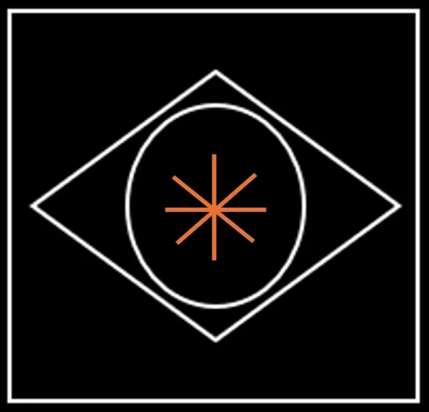

Artwork: *In the Blink of An Eye*: Insight that arranges equivalence to express complexity however that trinity of architecture is framed across latitudes *and* the longitude. They are with bearing, right here, right now, watching the world wake up from history.

 

## Introduction

>Walk on, through the wind
>Walk on, through the rain
>Though your dreams be tossed and blown
>
>Walk on, walk on
>With hope in your heart
>And you'll never walk alone
>You'll never walk alone
>
>~ Gerry & the Pacemakers (You'll Never Walk Alone)

Here, I introduce the concept of **Giants** (entrenched, coercive and hard power) and **God** (soft power) actualized as individuals developing and expressing virtue or arete; through deliberate practice they achieve *autonomy* from giants and the machina animus*. Autonomy is as close to a freedom as is gets without the ultimate liberation of the soul from body. Autonomy is the capacity to do as you require to live well: be free from arbitrary and coercive authority) and their ability to perpetuate their control of you by influencing you to behave in ways that are *contrary* to your self-interest to their advantage. Your ability to understand self-interest  is required to sustain good health and to project that sustainability into Creation. Sustaining what you have with autonomy then gives you the opportunity to be creative *entirely on your own terms* - developing useful skills and attributes that allow you to appreciate and enjoy your life *as you model it* in the world and be an agent for positive change. 

Our autonomy is impinged upon by needs;  food, clothing and shelter. Their price (but not their value to you) is beyond your control. Within your command however is the opportunity to save a surplus to fund your future and so to secure your autonomy.

This was undermined in 2008 when the United States added a nominal 1.2 Trillion dollars to restore liquidity after a bout of malinvestment by institutions and individuals alike. Following this debasement the opportunities to invest in real-world yield bearing assets (known in parlance as value equity) was lost. This *debasement* has decisively undermined the dollar regime's credibility and legitimacy. In the aftermath protocols emerged to secure capital decisively beyond a hegemon's caprice. 

It is *globally* distributed and offers *any* regime the opportunity to secure productive outcomes for its people. Several are seizing this opportunity with effort to demonetize their regimes (by removing paper cash) as well as introducing unassailable identity assurance. Others are arranging themselves based on a confluence of interests.

The giants and their Leviathan are no longer be able to impinge upon the autonomy of a person (unless they themselves allow it) because they have lost the capacity to hold us in a system which arbitrarily assign a price for money (the interest rate). There is cause for optimism as this has profoundly positive implications for our planet and the preservation of its ecology if we are grounded in self-interest (self-preservation) in the context of our ecology: No threat is greater to our environment than the inflation (masked as money debasement) of the giants' incumbent system.

This a commentary on ancient mythology that has resonance today - of self-styled giants on the one hand and the notion of monism - or God: those who possess the divine within sufficiently and who sustain, create and transform truth into beauty in whatever station fate has placed them in the constantly emerging global reality.

**Arete** (ah-ree-teh) is an ancient Greek term that refers to excellence, virtue, or the fulfillment of purpose or function. In the context of ethics and philosophy, it encompasses the idea of living in accordance with one's highest potential, excelling in specific areas, and demonstrating moral character.

In Greek philosophy, particularly in the works of Aristotle, **arete** is central to ethical theory. For Aristotle, **arete** meant achieving the highest form of human potential through reason and virtue. It was not just about success or talent in a particular skill, but about flourishing in life by cultivating good character traits, such as courage, wisdom, temperance, and justice. In short, **arete** means living up to the highest standard of your abilities and virtues, embodying the pursuit of excellence in all aspects of life. Arete involves:

1. **Excellence of Character:** Living virtuously by practicing good habits and making morally right decisions.
2. **Achieving Potential:** Striving to reach one’s personal best, in whatever field or role one is engaged in—whether intellectually, physically, or emotionally.
3. **Rational Action:** Acting in alignment with reason and living a life that fulfills one's function or purpose, as it aligns with human nature.
4. **Balance of Virtues:** Arete doesn't mean being perfect in a single aspect, but developing a well-rounded character, balancing traits like courage with temperance, and wisdom with generosity.

## Reality Bites

If you are to question authority with any degree of credibility its because you have a broad enough perspective to be utterly decisive in making the call; to harness the gathered momentum and reach decisively for your *Calling*;  you have watched enough of the information for a long enough time. What's changed is you. You're older and freed from the need to persist with the incumbency. Alternatively you are young and absorb rhetorical reason that resonates with your instincts.  Your debts to civilization paid in the form of self-aware offspring successfully launched. Alternatively you are young and focused on self-actualization and whatever that implies as the emergent context unfolds. Meanwhile time bears down with the ultimate truth of your mortality. Your head turns up finally from the mundane and scarcity is made a fraud. So you pivot hard towards the prospect a virtuous reality and autonomy.

I was introduced to Arete by Kitto via Robert Pirsig in *Zen and the Art of Motorcycle Maintenance* in my early twenties as I came of age steeped in the social sciences particularly history, political science and economics; and then pivoted towards the *real world, particularly finance and information technology, to understand *in practice* rather than theory how the gap between truth and beauty might be better minded. 

> Thus the hero of Odyssey is...an excellent all-rounder; He has surpassing arete; an efficiency which exists, not in one department of life, but in life itself.
> ~ Kitto

This is important at key cyclical moments; turnings where capital has been debased. Historians derive considerable information about ordinary conditions for common people at certain periods by examining the alloy in coinage, measuring the *adulteration* of silver or gold and then assessing it against comparative standards of prosperity and well-being for different classes or 'professional' communities. Without the benefit of the broadly disseminated information we have today (the ultimate capital in any time and place) ordinary folk were at disadvantage in the past. We have solved for this considerably by making market data freely available and many individuals exploit this data. However structural impediments or preferences still have *communities*, those whose aim is something more than material prosperity; ethical innovation, civic projects, open-source culture, cultural and ecological preservation at a disadvantage because markets are not geared to always rewards these things. Market systems optimize for wealth capture, liquidity, and efficiency, not for ethics, creativity, or shared social value. Autonomy from incumbent market driven systems and institutions of any kind entirely solves this. This is a time to cultivate ordinary skills of self-preservation and sustainability; to reclaim the administration of health and welfare; then project this in exemplary fashion as virtue.

## Virtue (or Arete)

> Ἀλλὰ Ζεὺς ὁ πάντων ἀκουστὸς ἀνδρὶ ἀρετὴν ἥμισυ λαοῖσιν ἀφαιρεῖται, ἐπεὶ ἄρα δούλη ἔπειτα ἔλθῃ.
>
> For Zeus, who views the wide world, takes away half a man's *arete* on the day when slavery comes upon him.”
> — *The Odyssey*, Book 17, line 322

Virtue (a sense of ethics) is a key concept in human-centric architectures that aim to scale human interaction and cooperation to achieve meaningful positive outcomes. The aesthetic quality of the outcome is critical and virtue ensures that competition, a powerful impulse is aesthetically acceptable and that functionality follows only good form (efficient, elegant, and tasteful from *any* perspective). Virtue can be seen the practice of turning the competitive impulse upon oneself to cultivate meaningful growth. This is what the Greeks called Arete (Aἀρετή).

The idea expressed above by Homer *subtly* is that comfort over time invariably yields discomfort for those who enslave and exploit, not to mention also the enslaved when the opportunity for the swift liberation of moksha (death) was there for the taking. A slave is one who has forfeit control (autonomy) of their own life. They chose life of a kind (something better than nothing perhaps) instead of life with autonomy. For both master and slave opportunity to cultivate arete has been removed.

For the victor comes the long Faustian bargain. They lose their autonomy incrementally by first surrendering the opportunity to express themselves as basic human beings; It begins surreptitiously as they demur on menial tasks, walking or the preparation of meals for example. Spoiled by their accumulated wealth they eat and live lavishly and are ever further from the world as it is and less capable functioning in it. In every sense they become removed from reality - how the world is and how people live in it. This attribute carries across generations. Offspring inherit indifference, complacency, insouciance and callousness as much as wealth from their parents. The comfort derived from wealth evolves into discomfiture in plain-spoken company as indifference is reciprocated with coerced deference but also quiet disdain. In the modern world this tendency has spread to ordinary folk who dutifully execute conventional activities yieldlessly (D.E.C.A.Y). Some kind of life is better than nothing and they contend themselves with a place in a pyramid. Even as these, relatively innocent gather in their various communities, their indifference to the plight of the rest of world, the 'other' leads ultimately to sporadic volatility and crude intrusions when those others, lacking now even basic needs (food, clothing and shelter) begin to push back.

The titans of our pyramids are celebrated. They are giants who have accumulated capital and entourage. Their use of largess to delegate responsibility diminishes insight and they become systemically unaware of the unseen fragility accumulating as the polarization of those who have (more than they want) and those who have not (less than they need). Soon both they are destitute of options to manage strategy because they lack vision in *almost* a literal sense and so volatility appears.

Homer's tidy stanza above was expanded upon in a modern myth at the turn of the last century in the novel *When the Sleeper Wakes*. In it Wells imagines a London where most people have become passive dependents on vast, automated systems and monopolistic corporations, while a small elite governs through mechanized convenience and economic abstraction. The ruling class and their technocrats live lives entirely outsourced to institutions and machines — their food, entertainment, decision-making, even moral life — leaving them spiritually empty and physically enervated.

Outsourcing human responsibility—both personal and civic—creates a form of living death. The masses sleep, and the rulers, despite their comfort, are little more than custodians of a machina fueled by animus - war and extraction - from both planet and human identity.

Never doing *any* manual or creative work. Their comfort is total; their decrepit frail bodies and minds dulled by a life of leisure and excess. They are incapable of defending themselves having outsourced courage, labour, and imagination — and in doing so, they lose their humanity and legitimacy:

> “The men of the upper world were scarcely men at all, but effigies of comfort, pale with inactivity and sated pleasure.”

In this world, the elite have grown dependent on their *machina animus*.  They live in a state of privilege becoming ever more infantile and delinquent. The delegation of work, entrenched and layered, they remain blithely unaware of its fragility; it's not so much that their system is prone to collapse but that they are impotent; powerlessly watching what remains of their brightest and bravest defect with ease. The protagonist, Graham awakes from suspended animation to find this world. Like the proverbial frog he jumps from the pot to live autonomously outside the system rather than suffer the slow death of corruption as it cooks him. He becomes a locus for change.

Later, at *mid-20th century*, a different myth took shape in *Atlas Shrugged*, where the world is populated by those who demand results without responsibility, and those who produce value withdraw from the stage entirely. In Rand’s vision, the industrialists, inventors, and creators — the “Atlases” holding the world aloft — vanish, leaving a society that has learned to *depend without comprehension*.  I encountered the book in 1994. Years later, such was its influence on me that I considered naming my first daughter Dagny, the novel's central character. In the end a hardcover edition was my  gift to her when she came away from Western with an Engineering degree precisely so that she might understand *arete*. 

The masses, bureaucrats, and politicians continue to move the levers of commerce and government, but their hands are empty of skill, courage, or insight. Systems grind on only through ritual and mimicry; rules are enforced without understanding, policies enacted without efficacy. Meanwhile, the productive minority, weary of moral and intellectual exploitation, retreat into seclusion, leaving the world’s mechanisms to those incapable of sustaining them.

Outsourcing responsibility, whether civic, creative, or economic, produces a hollow society. Comfort and privilege for the few who still act as intermediaries is shallow — a life of papers, speeches, and symbolic gestures without real creation. The machinery of wealth, culture, and knowledge remains in motion, but it is animated by ghosts of competence that have withdrawn:

> “The motor of the world had ceased to turn; the men and women in offices were only the echoes of the hands that once had built it.”

In Rand’s admittedly materialist landscape, dependence breeds decay. Those who remain in positions of apparent authority are physically intact but spiritually inert, incapable of defending, inventing, or even understanding the forces they purport to command. Power is no longer a function of capability but of ritualized assertion. When the world’s greatest minds shrug, it is not the collapse of structures that terrifies, but the impotence of those left behind: powerless custodians of a civilization whose vitality they cannot summon. 

John Galt is the catalyst for change in Rand's world. He encourages the world’s producers, inventors, and innovators to withdraw from a system that exploits their productivity without respect for competence, which amounts to acknowledging and respecting his vision and objective; the cause and the mission - not his ego. His ego comfortably manages without their obsequious flattery and meaningless tokens of recognition. He would sooner not be recognized even in the literal sense of the word.

## Entropy of Virtue

Russians have a term компрома (*Kompromat*), short for 'compromising material' which since the advent of photography and telephony *usually* referred to embarrassing information about an individual used to influence their behaviour. Previously one's *true* reputation was an aggregate assessment of credibility held within one's socio-economic *strata*.

This idea gets amplified and turned on its head once a money has decisively lost its mooring. The quality of a regime's money dictates the security and comfort if can afford. *De facto* when money has lost its foundation neither security nor comfort can be bought. More profoundly disturbing is that increasingly it is no longer available *de jure*. Judicial systems creak under the weight of codes defined to protect both property and person where increasingly the former has priority over the latter because giants govern and will always place theirs (if not themselves) above the rest. When the choice between who survives, a giant or a person, it is the giant; because he is now considered systemically indispensable whereas of course the common person is expendable.  This Disparity in outcome is self-evidently untenable and indefensible (except to giants) and so increasingly even the performative elements of their authority fail to impress us - in terms of meaningful outcomes or as aesthetic representations of who we are.

Giants holding tenuously to power are now willing to do *anything* to anyone to protect their station in society while affecting what they believe to be positive change within increasingly limited constraints. They are heroic, loyal and virtuous, in their minds, as are we all. However they have come to believe they are indispensable; that ordinary people in the world will fail to live good lives without them. When ordinary people express autonomy in ways that are aesthetically appealing it is a challenge to their authority and dominance and their system will resist.

The matter at hand heroism, loyal and virtue. But to what end, objective or mission? Let's examine a third twentieth century myth, Tolkien's *Lord of The Rings* published following that century's great conflicts. There are some who like the hobbits of Tolkien's Middle Earth perhaps, who want to be left to quietly live untroubled by the cares of the great world. Others, like the Aragorn who roams to assess the evolving world away from the fray. Like Graham he withdraws to the periphery, returning when the world of men need him. Like Galt he draws the likeminded to challenge the incumbency.

The incumbent system is represented by his decadent libertine patriarchy, the arrogant and complacently corrupt Denethor II of Gondor and by the decrepit Théoden of Rohan. Both resist reform until it is almost too late. The ecology and civilization in it declines as a result. The Fellowship forms to challenge this incumbency from one side with virtue while a nihilist anti-vision challenge grounded in pure self-interest from another - an alliance forged of Sauron, a *maia* or spiritual force. I interpret Sauron as ignorance; Pirsig in *Zen* reminds us that *maya*, in Hinduism is the cosmic veil concealing the true nature of reality. It has grown dense, now capable of coercive gravitational of those too weak to resist its pull. The *maia* Sauron joins forces with a manifestation of true competence and power but one wrought in the name of self-interest and self-preservation; the powerful wizard Saruman. Together they represent competence and power directed in the interests of a collective veil of ignorance.

Theirs is a fierce puritanical vision shorn not only of sensuality but all empathy for either the *anima* (the Fellowship) or its jealously protective cousin the *animus* (Fallen Gondor and Rohan) in humanity. Their *machine* creates the power needed to usurp all control with monsters who reprise Mary Shelley's in Frankenstein's Monster (also known as *The Modern Prometheus*). These are mass produced in dark production lines beneath the surface far from sight.

Aragorn's peers Boromir and Faramir at Gondor have virtue, loyalty and heroism in spades but lack the ranger Aragorn's broad scope and vision. He has the objective perspective to assess the gap between truth and know it to be profoundly removed from beauty. Legolas lithe, mobile and ethereal of the long lived Elfin, is a stalwart ally from a tribe with equally broad insight. Meanwhile the hobbits and their dwarf cousin Gimli are good humoured connoisseurs of merriment and stout journeymen. The three who dwell in forests, mountains, and hillside homes close to life in all its forms add a sense of joy and play to Boromir's strength, steel and superficially aesthetic authority; Boromir in turn must finally and reluctantly relinquish this authority to his more subtle brother, captain and king Aragorn. They are quietly marshalled by the *personification* of masculine Anima, Gandalf.

There will always be an Aragorn. That *is our hope*. He represent the *eternal* faith rather than a literal truth that life matters and is good. What sets the Fellowship apart is their sense of mortality. They will die - that much they know to be true - and it is *the* defining quality of all that lives. However long or short, life may as well be a journey worth taking. This sort of thing is spoken and written so often as to have become trite and worthless. It can only be understood viscerally through a life lived and survived close to the very edge for it to be absorbed and ring true in action. Which is why so many of us are drawn addictively and tantalizingly close to death in all its forms as a preoccupation even in leisure.

The uncompromising quality that sets Aragorn apart is vision borne of observation and the quiet introspection. When the time came the Fellowship emerged as coalition of the willing and bootstrapped; those with sufficient courage and intelligence to *refine* and reset their loyalty as they gained data. Those with enough patience, humility and skill to challenge and bolster Aragorn's *primus inter pares* leadership as he himself does them to lead a quest against barbarism to end it for all time in the fires of not man but of *Creation* itself.  It is the quiet corruption of the ring that is a barbarous relic - an shiny ornament for the Raven and ravenous that Boromir still values and covets. The shards of Narsil, made of *base* metals represent true legacy. Unadulterated and functional.

## The Yield of Civilization

Those who question the legitimacy of incumbent institutions and the Sovereign recognize that priorities have been inverted. Value itself — once rooted in enduring culture and the shared pursuit of truth — has been reduced to “the price one pays.” Society, in its endless churn of transactions, regenerates itself at the cost of meaning.

This inversion has made what was once priceless — autonomy, craft, permanence — cheap, and what was once trivial — speculation, image, novelty — exorbitant. The inverted yield curve is not merely an economic anomaly; it is the symptom of a civilization that no longer knows how to value time.

The only enduring work worth building is oneself. The Stone Rose: the cultivation of identity, virtue, and capability. The truly free — those who see through the coercion of arbitrary authority — seize the day to live as they dream.

Yet when the positions of esteem become the object rather than the outcome of character, civilization enters decay. The myths of the early twentieth century remind us: the comforts of progress often precede the conflagrations that destroy it. There are x aspects to character: The ability to apply reason and empathy (Intelligence), an ability to care for things (Capital), an understanding of one's place in the world (Identity) and a sense of how to manage one's life constituent of those elements - a (Governance). What manifests is a meaningful sense of who you are - a semantic perimeter of identity embodied (semper idem). Autonomy enables this to make one self-sovereign.
