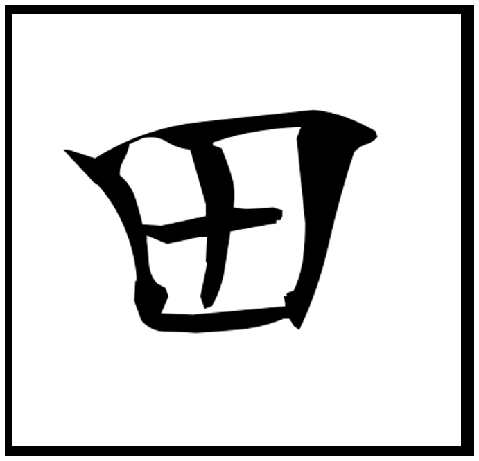

The Japanese character for paddy field (田) is both literal and metaphysical: structure without possessiveness. It frames functional space for cultivation, not control. Stroke order matters—not because of tradition, but because efficiency becomes crucial when you’re learning thousands of characters. Routine develops with automaticity. Anarchy too needs structure—not imposition, but order that justifies itself through use. Happily, our notional reality is bounded and finite, as it is on earth—and within it you will discern Christ-consciousness (which, if you know the stroke order, you will see as a prerequisite for creating the enclosure). Now you know the meaning of *underlining*, or to “draw the line,” or create a platform, or set a foundation.

>Those who came before me
>Lived through their vocations
>From the past until completion
>They'll turn away no more 
>
>~ New Order (Blue Monday)

## Introduction

This piece explores how the possession of (self-sovereign) order and structure is consistent and *necessary* to affect anarchy, which is not, as “consensus liberal democrats” would have you believe, antithetical to constructive behaviour. Anarchy is too often conflated with chaos. Chaos implies *apparent* randomness—a result of the inability to correlate cause and effect amidst increasing unmanageable entropy in the human condition. Whereas anarchy implies creative and improvisational awareness to discern *self-evident* order and priority through the application of enlightened vision to the flow of information that swirls around you. When systems become too complex to drive, you let go of the steering wheel, breathe, and allow circumstances to manage you while you, in turn, respond to their signals rather than instinctively reacting. This requires the development of an *enormous* sense of presence (awareness). You are aiming to travel through life deeply embedded within your circumstance. You are seizing the day. A misunderstood term, it means to fully apprehend it viscerally in all its vivid detail, from the microscopic to the cosmological. Only then do you see the opportunity of greatest magnitude, placing yourself, hands cupped for the perfect catch in precisely the right manner.

STOIC (Stop, Think, Observe, Introspect or Intuit, Create) is a heuristic for this process of developing awareness. Coincidentally, so too is the philosophy of embracing “fate” in this way called stoicism.

Behaviour (action, which includes gestures and expressions in the presentation of oneself to another), if it is to be meaningful, efficient, and effective, always begins with *inaction*, which at the very least mitigates the potential for causing unnecessary harm to either others or oneself. It begins with stillness and practical observation of oneself in environmental context, then leads to a settling of ideas and emotional and physiological imbalances within, before a decision is determined with holistic thought (embodied cognition) on how to create positive change: Stop, Think, Observe, Introspect, and finally Create. Whether one is deciding how to spend a day beginning in the quietude of the morning sun or de-escalating a stand-off with an assailant early on a Sunday morning, this is the most practical approach.

In short-term “vertical” cycles (tasks versus deliverables or milestones), these become processes, routines, or scripts, which are validated *routinely* simply by being run and self-evidently resulting in positive change; they evolve as required. One doesn't have to create a list item “create a shopping list” and then cross it off when about to begin creating the shopping list. One simply begins creating the list (preferably by visualizing the store and walking through it in a logical and enjoyable fashion, collecting the things one needs). At some point, the list begins to make itself. You know exactly what you need and how often. In other words, it becomes ritualized.

At another level, a list isn’t even required at all. You just go when you want and get what you need, generally because you've simplified your life to the point of having few requirements. Your sense of wonder is such that a visit to a supermarket may as well be a trip to a museum because you have what some contemplatives call beginner’s mind—you’re again impressed and grateful for things others have come to take for granted. This reinserts a lot of the pleasure back into life that is missed in the humdrum mist of “bullshit jobbery.”

The STOIC approach to constructing a “design for life” lends itself well to an outcome that, in hindsight, looks planned from the beginning. You’re developing the path as you walk deliberately and slowly to reduce the amount of toil (work that entails no growth or learning). As you walk this path, you “try” various building blocks of the *stone rose* you are creating of yourself: accumulating habits, practices, skills, hobbies that naturally appeal to you.

## Self-Government

When these processes are applied with consistency and include a degree of introspection - an inward gaze that seeks to know why without symbols (in word or thought) -  a 'horizontal' roadmap develops, and through attraction (a curiosity that seem requited) may then be persisted as a route through life as a calling. As an aside, this has relevance in the governance of a political-economy.

Because in a self-similar, fractal sense the same may be said about community or nation-state. The anarchist will generally feel that the starting point for discussion is one's purpose for existing. Each individual human being being non-fungible and unique will have a different but equivalent answer that makes them relevant to the world.

Someone who amounts to more than just 'a job' or a role in a household. Instead one is a grail or a cup which holds 'one's life's work' (an all-encompassing vocation or mission). Practitioners in so-called pluralistic liberal democracy on the other hand  generally go straight to subjects like growth, inflation and jobs, cancer, immigration since their frame of reference is not the individual but fungible 'categories' of them (sex, ethnicity and so forth) assembled to gather a seeming plurality of consensus or alternatively consigned as expendable 'collateral 'damage' those who won't get there's this round. Such is the practice of politics (with or without resort to violence) in the grand struggle for victory at the ballot box.

The way in which the word canvas is used in electoral democracy and its version of capitalism (indeed politics is a market for revenue in public relations, communications, digital marketing and so forth) versus how people in the real world (anarchy) is illuminating:

**POLR (Path of Least Resistance) Electoral Politics:** 
To *pander*, *posture*, and *collect data to manage the ground game.* Reduce people to voters or demographics in order to feed them into their system. Voters are then free to judge outcomes (or leave the 'system'). See also 'gerrymander' and efficient allocation of lobby-issued financial resources for the manufacturing of electoral 'consensus' for further details.

**POMR (Path of Most Resistance) Creativity & Anarchy**
A blank surface for *creation*, *vision*, and *truth*. The artist begins with nothing but perhaps a common-sense notion of causality (or how things come to be or not to be) to bring structure and meaning to life or to express its counterpoint. This is the realm of expressing sincerity, subjectivity, and beauty or alternatively its presentation by expressing (for propaganda purposes) what it is decidedly not (Examples: Orwell, Kafka, Dali, Guernica, Damien Hirst, Banksy, Baron-Cohen, Black Mirror)

We'll apply this regime to policy later and do note, that from an anarchist perspective this example is relevant because anarchism asks you to personally take responsibility for your welfare and not to outsource it to the incumbent institutions. Applied at the personal level it seems mundane even banal. If it *looks* 'a bit lame' it will nevertheless still insure you against the prospect of being literally lame over the long-run. As well as well save our institutions real money. As per Goethe 'Let everyone sweep in front of his own door, and the whole world will be clean'.

As a corollary to this, when no one else is willing to sweep in front of their own door as you do yours save yourself for the things you love, minimizing your contribution to a broken commons by declining work that doesn't offer personal growth or roadmap a path to having the kind of agency that allows this. When 'each is conditioned to give not according to their ability but only according to what they are required by the terms of some contract, continue to give yourself fully - but in kind and as *you* like it - and not as a wage slave or as a volunteer in some capacity *they* deem necessary again and again. Seek instead to preserve Creation. 

## Trinity Bellwoods Park

> But he that prizes a soul which is rational, universal, and civic, no longer turns after anything else, but rather than everything besides keeps his own soul, in itself and in its activity, rational and social, and to this end works conjointly with all that is akin to him
>~ Marcus Aurelius, Book VI - 7

The framework rests on the simple triplet of “sustain, create, and transform,” represented by the Hindu deities Vishnu, Brahma, and Shiva. This triplet forms the foundational meditation for shaping Trinity Bellwoods Park—or, more broadly, a vision of heaven on earth. It's my matter-of-fact Anarchist common-sense version of Plato's Republic or More's Utopia. Ideas burdened with grandeur much like people or institutions with titles will struggle with the burden of expectation who have bought into a mythos (democracy for example). As well there's no need for a grand overarching vision of a 'promised land' if you have a practical and pragmatic approach to incremental change in you and your immediate surroundings. The positive impact compounds exponentially over time. You'll radiate competence and set an example in how *you* govern yourself. Which is all you can really do. Then you wait for the people and communities who would naturally come into your path to do so. In the meantime, you're left in peace. The challenge is that much like hedonistic adaptation (it's the opposite in a way), you develop an appetite for construction as you positive change and you reach out for 'perfection' (utopia or 'republic) and *that's* were the return to 'sustain' (equilibrium) becomes critical. 

The likes of Goldman, Chomsky and Graeber kept things 'ordinary' - which is perfectly fine. In fact most people would agree more 'ordinary' would be an improvement on our 'interesting times'. Starting with Trinity: the triplet recurs throughout thje anarchic modeling of governance you'll find across Regnum Dei, reflecting a balance between structure, innovation, and evolution. These models also emphasize clarity or truth (bell) and ecological attunement (woods).

On a macro scale, this framework resonates with a civilizational trinity, as seen through the lens of dominant patriarchal narratives: Father (structure), Son (innovation), and Holy Spirit (evolution). The Father embodies the weight of heritage and authority; the Son, the restless dialectic that challenges, destabilizes, and experiments with beginner’s mind; and the Holy Spirit, the distilled wisdom that emerges over time from their interplay. Together, they form a dynamic triad that models how systems—whether spiritual, civic, or ecological—sustain themselves, generate novelty, and evolve toward greater harmony. 

Finally, Park emphasizes that good is often done more effectively by *removing* a commission or through an omission of an existing commission rather than additively. The former is efficient, at the very least reducing energy consumed while the latter invariably has a cost of time and/or money. As well any change in our systems amount to a hypothesis whose impact in an entropic system is extremely hard to model for consistent balanced positive sum across all three macro layers of governance. As well we accomplish much by simply parking ourselves; by being still, quiet or at least slow and deliberate in action. Such is the state of our planet's climate crisis that unless you feel positive about your work, you will actually feel good about the 'Park'. The elimination of excess emissions, consumption of materiel, the emotional and physical energy consumed. As well you can feel supremely satisfied that you're no longer paying into liberal democracy's debilitating tendencies - those of both its coercive and pacifying instruments of a metastasizing state apparatus that whatever its intentions oppresses originality, authenticity and creativity. 

Trinity Bellwood Park by the way is a simple ordinary urban green space in Toronto's west end - i.e. something much cherished and taken too much for granted because it simply exists. I have no doubt that it and the many green spaces Toronto is afforded are essential to the quality of life in the city. TBP however has a special significance for anarchy as it was undoubtedly a stomping ground for the anarchist matriarch Emma Goldman. It's a thirty minute walk from where she lived at 322 Spadina Avenue and she most likely took a stroll that way as it was already popular with working-class residents for leisure, meetings, and rallies. People still gather their communities to talk books, history, philosophy or just hang a while in each others' company or what have you. TBP is also a short walk away from Downward Dog then located at 735 Queen Street West. I spent many hours early in the morning cycling through the Ashtanga Vinyasa primary series deepening my contemplative practice in what I called my own community at the time with teachers Diane Bruni and Ron Reid. Then I'd head off to work - and my career at IBM Global Services.

> Love, and do what you will.
> ~ St. Augustine of Hippo

The improvisational TBP replaces the often arbitrary decision making that emanate from hierarchical systems with an alternative guided by conscience - yours and those of the people you attract to your approach to life - focusing on that which is immediately in front of you. The approach ultimately balances the interests of the self to those of the Commons (community, however defined) and Creation without conscious consideration of that idea. The process assumes complete agency which means that anyone in a situation in which agency is diminished without compensation, i.e. valuable instruction at a minimum, will invariably extricate themselves from such a position. Let's put TBP into practice. It involves one of two basic models:

**Satyam, Shivam, Sundaram (Truth Divines Beauty):** 
This is Hinduism's central philosophical triad. It is a framework for discerning dissonance in the reality of a thing and then making an adjustment to increment it in the direction towards something better. By the way this is how scrum and agile methods work in project management with the focus on a single use case (objectively prioritized based on discussive consensus and objective data  - analytics to discern value) and how user experience of it may be incrementally enhanced. When you think about it, you aim to project your life, incrementally managing its vector to derive contentment. There's no maximum contentment, though I have felt truly extraordinarily moments bliss at times but we do know minimum contentment and it requires taking a thing we value that dissonant and tuning it to align with something that resonates with your being. Whether it be a home project, artistic endeavour or personal health.

First we require clarity and truth to see something clearly so we might properly assess it. We contemplate on it (i.e. divine) and ask is it in alignment (emanate beauty). If not then what adjustment given current capability or capacity, incrementally elevates it. Having achieved this new level we grow accustomed to it. What you will find is that beauty generally implies benefit to the ecology. It marginally saves the ecology by being less consumptive (of money, material, time, energy) ; that is to say, more simple and efficient: *sufficient and elegant*. The heuristic is the feedback from you environment: It will be positive and, at the very least, less noisy.

**Sustain, Create, Transform**
Another way of looking at Hinduism's philosophical triad of (Brahma, Vishnu, Shiva). This triad simplifies the prioritization of our objectives. There are only three objectives. In order of priority:

1. <u>Sustain</u>: Ourselves, and the whole of our physiology across all dimensions, as well as the Ecology upon which it depends. There is no other objective on par with this. Again, as well I can point to software development; the production environment must be stable. As well where there are opportunities to do production 'as is' better (at a lower cost say), then that's even better than an enhancement because you're improving the stability of the existing structure before adding to it. Interestingly in reality 'product leaders' prefer to add functionality, a) to have something new to 'show and tell' and b) to keep their OPEX budget intact. So they can't discern and aim for *enterprise* strategy even when it's aligned with environmental objectives (lower financial costs always equal lower environmental impact in data and compute).
2. <u>Create</u>: The change required in our circumstance which at a minimum involves creating relationships (community and partnership). This happens through the process of sustaining - we groom and prepare each other to fit the roles our community needs, all the while attentive to particular attributes which make us suitable for this or the other thing that needs creating. Then we create something. Enough to extend our sense of comfort without spoiling creation (keeping in mind our primary objective - of sustain. Having done this we look out at our community and beyond it to see how may scale comfort.
3. <u>Transform</u>: This is the incremental adjustment to what we have created. Something that is sufficiently good but may yet be improved or scaled: extended in some way, qualitatively or quantitatively through the Satyam, Shivam, Sundaram model above.

These are improvisational approaches rooted in introversion. It is why Shiv plays such a central role in Yoga tradition. That tradition of yoking self to community and commons is the true essence of Yoga. We may strike a pose and there is benefit to that no doubt (to an extent) but it is the contemplation with accompanies it that forms the kernel of intelligence.

## Evolution

Our evolution both as individuals and as a collective (i.e. a species) happens because we codify practices that we deem constructive and beneficial in *our* *glass* or holy grail. It's the spirit of humanity distilled. As we journey through life we'll encounter practices that feel appropriate to adopt and make them a part of our identity. Stone by stone constructing something which rises (grows) to full maturity tap into those distilled 'best practices' of our collective. Call this the *Stone Rose*. Each a bespoke *Hourglass Redcurrant* vintage.  Perhaps even one with something additive to our collective opus. The *Yoga Element* represented in Yoga tradition as the Lingam is the human legacy which values the trinity, however it be written holding us together to the degree we recognize we are from one, many. In the end, it is all one thing, or a hundred-odd chemical elements in a periodic chart, or an infinite array of those elements in a deep, poetic assembly constantly reconstituting itself—many from one.

The three again and again are shown in various reflections of structure, innovation and evolution even as I express them in this corpus *Regnum Dei* as the *semper idem* - an unchanging identity which nevertheless evolves in life as one and the many in all their myriad ways.
