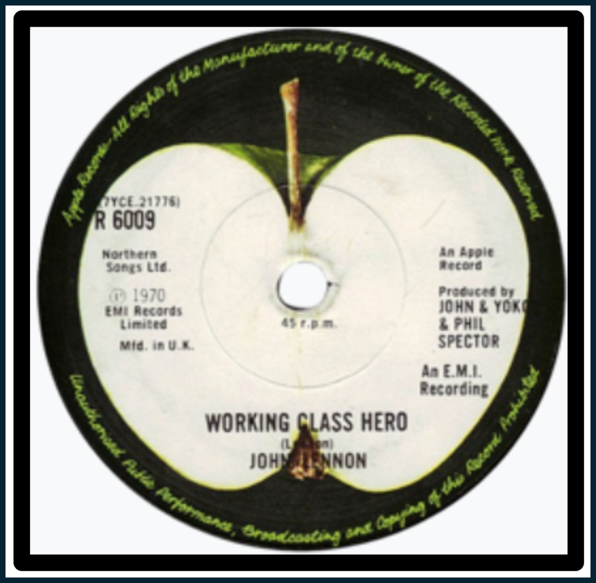

##  Social Insurance

I've discussed Intelligence as liveness. Firstly the *vital* nurturing Anima expressed by plant life. Added to this is the active or *spirited* animus most usefully express with a disciplined boundness by animal life including humans; wary, watchful and ready with clear-sighted peripheral vision and a capacity to pivot from a posture of de-escalation t

**HERE**

I've alluded before to Eden and suggested that the apple might have been allowed to fall instead of being eaten. There was after all only the one; Adam and Eve yielded to temptation when they might instead have held themselves for a while to wait for yield (perhaps of both kinds). Our time is ultimately the only thing of value there is, and this story asks that we simply *be* and let the harvest come of its own *accord.* It is also a reminder that scarcity in materiality is absolute (we have one planet) and we consume without first assuring it's at our peril.

Let's examine St. Augustine's 'fulfillment of the law as love'. Love is the provision comfort where discomfort prevails. In a state of nature (Eden) an innocent is helpless, and a duty of care is required from the capable who adapt the state of nature with creative effort that is productive. That duty of care is appreciated with the gaze of child's wonderment and utter joy when someone with true agency cares enough to pay attention and delight them with magic - either purely performative or genuinely comforting in an emotional or material sense. 'What a piece of work' - whether it continues to assess you to be noble in reason and infinite in faculties, in form and moving how like an angel, in apprehension how like a God is written upon its face. You have now been made, in its eyes, one hopes, in God's Image and so a *Christ's* Consciousness is called for.

To do so often requires the transformation of the state of nature - a taking from Eden to provision basic needs; trees for shelter that once provided for fauna for the ploughing of fields that displaces or harms the creatures that once dwelled there. This is 'not guilty'. It cannot be considered innocent however in an ethical context because you are now removing from creation or (if a framework for sovereign governance exists) from the commons*. As well, for the introspective and sensitive among us the disparity created between our own increasing comfort (and complacence) jars when juxtaposed against the realities of world at large as comfort drifts into relative opulence. The consequences are the trials of Job and an unravelling psyche as we no longer find attraction in our work. This too accelerates us into the realm of 'guilty' or 'non-compliant' as we inflict damage to ourselves, to the commons and to creation beyond it.

To what degree this becomes untenable and exploitative is the degree to which comfort bleeds into excess (call it opulence) and thereby consumes capital that may have otherwise been deployed to create minimum comfort to others. As 'not guilty' move to guilty taste becomes a meaningful heuristic to anecdotally assess social credit (or trust) in the 'real' world.

It is a truism in political economy that underdeveloped regions will experience higher rates of growth relative to developed ones as markets are created. Essentially what we are talking about here is the creation of transparent yield expression so that those opportunities may be identified and capital deployed to them. This is as true for an individual as it is for a sovereign domain. Once you have enough to live indefinitely with reasonable margin it stands to reason you stop expending energy and effort in work that now has negligible return on investment particularly if someone else is available to do it. If money were no object, what would you do? That's the question you now pose to yourself because you may then pursue whatever work yields value to the commons that attracts *you*.

In the digital sphere, protocols to align self-interest to those of the commons secure the network and generate yield - the degree to which surplus capital is meaningful staked to productive outcomes (such as initially securing the network) accumulates to secure the needs of life; whatever surplus generated may subjectively be applied to meaningful change in the world. This is of value to me. In practical terms I am reducing my expenditure in terms of material and energy and accelerating my output; I am sustaining myself (body and soul) and creating digital content - which at the worst has no value to anyone whatsoever but which thankfully at least results in no discernible negative externality to Creation (or your neatly partitioned secular commons) given that my electricity consumption is net-zero and renewable.

## A Return to Innocence

Optimism is the return to innocence; the liveness which dwells mostly in the anima and which only gambols rather than gambles in Animus. That has the 'number go down' in a reversal of the speculative opposing mantra towards both the mythical and the ever so real Eden of which we have been made custodians; to manifest the promise of abundance as we first sustain, then introspect on how we might create more with less toil and spin to transform suffering in our midst - first and foremost of our innocent - and without reference to affiliation and tribe. There is no cultural appropriation of our common human heritage. It is all sacred and indigenous to the planet. Know that neither you nor I have rights, but only obligations - to one another - and the privilege of being an aspect of Universal consciousness.

\* I don’t much care to distinguish between the commons and creation — that’s partly why I identify as an anarchist. For us, it’s all a common. The tendency to separate 'man' (whether as commons or sovereign) from 'nature' (the planet) is not only artificial but dangerous; it leads quickly into peripheral debates about sovereign interests, the rights of sentient beings, and definitions of sustainability. These discussions often spiral into attempts to engineer complex solutions atop flawed governance models — models that can’t derive global consensus, no matter how much data they process, because they are misaligned with the scale and nature of what’s at stake.

Still, I draw the distinction here only because the term “tragedy of the commons” is so embedded in discourse. It assumes negative externalities are inevitable and unmanaged — which is why I find most sovereign claims to legitimacy unconvincing. What we are facing, after all, is not just a tragedy of the commons, but a tragedy of creation: a planetary crisis.

Transition Insight proposes frameworks that take full custody of creation — a role we are evolutionarily equipped for and ethically bound to uphold. That’s the true duty of stewardship. As a symbolic example, consider paper cash: an archaic contract, over 4,000 years old, that literally costs us trees while offering little governance once released into circulation. It is both a relic and a liability — vulnerable to crime, terrorism, and systemic fragility.

