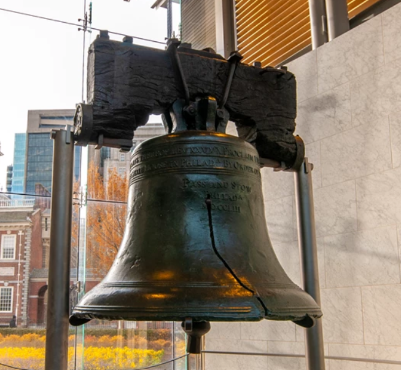

**Warning**: This is stream of consciousness and may feel incoherent and somewhat manic (but it is a rational assessment nonetheless).

## Sitting Bull > Shitting Bills

The old 'sacred cow' was Sitting Bull — on tour with Buffalo Bill over a century ago, paraded across a continent rich in bison but scarce in actual buffalo, save for one town a two hour drive south from where I am, nestled by a river with a single ‘rapid’ adjustment to a new level if you miss it. If you're paddling the right way, you can't miss Buffalo but if you do, Godspeed - you must be blind and one wonders how you managed to get this far with such a badly forged bell as signature icon representing liberty. If it's the ultimate liberation of moksha you seek then continue; your destination lies ahead.

The quality of your J-curve stroke doesn’t matter if you have the liberty to point your canoe the wrong way and stubbornly persist in the face of all that is holy and righteous. God's grace cannot save face for the transparent fool.

It's an unholy bullshit mess that cannot easily be un-fucked. There is land ahead mind, an escape of sorts ahead called Goat Island. If that's your 'safe' landing zone then you're the GOAT (greatest of all time) scapegoat; too stupid for dangerous things and places and who now needs to be bailed out at taxpayers' expense with helicopter money (money to pay for a real helicopter with which to airlift you).

You're no transcendentalist in a canoe so park the philosophy next to your SUV — the over-engineered, thirsty special-purpose vehicle that brought you here.

Stick to the functional requirements and set aside your 'bells and whistles' for now. This bell (photographed above) looks non-functional and maintenance (just keeping it held up without any kind of fix or patch even) is an extravagant expense. We ask 'Guns or butter?' and you respond by asking for a staple gun (is it a staple or a gun?) and then haven't used it to fix the bell. Something was lost in translation; these are kitchen table matters and we're in need of a different type of staples. Before butter is churned there is milk. Got milk? Even your milk comes with steroids and antibiotics which aren't functional requirements unless of course you were looking after all to hang this broken bell off of a bigger cow.

Paper promissory notes we call dollar bills are bills of sale for goods never delivered. They’re IOUs — promises unkept by the not-yet-truly-sorry. They flutter as semi-global confetti, grown on trees, heavily processed to mean something — yet say nothing fit to print that’s worth saying unless it is truly owned in one's own heart (In God We Trust). All others will pay the price demanded. The last thing we need is more 'cowbell' from cowboys who aren't.

## Food as Fuel For Thought

Humanity, endowed with the ability to imagine alternate futures, is at its best when it draws wisely from the material world — harvesting only what once aspired (that is, lived and breathed toward something greater) and has already transpired, rather than taking prematurely from what creation has not yet spent. To waste not is to want not; and to take life (sentient or otherwise) thoughtlessly, without care for its timing or purpose, is a form of mindless destruction — nihilism made real through minimal, careless acts. The yoga element is the immaterial rational and intuitively empathic connection that humanity endowed with true organic intelligence emanates as husbandry which is the careful management of resources — whether material, ecological, or even intellectual/spiritual. 

In the distant past we claimed deadwood to burn for heat and comfort knowing that is had already been seasoned by creation. Firewood remains a store of value even today when seasoned and kept well-stored (stocked). Spent well it becomes ash and may yet be of use in a compost pile. This is husbandry. However we never planted the tree to harvest the wood itself and not its fruit until we found 'industry' and now we cannot keep pace with the loss of our woodland. When it isn't mowed down to build things we can't possibly truly need, it is burned by creation in a world that grows ever hotter.

Husbandry too is the herding (i.e. the wrangling into ones keep) of live stock. Each item of chattel an object of value where even the shit, well-seasoned, will heat you, your meal or yet provide the basis upon which you may grow something with seed sown deliberately and with intention. Times have changed and the 'progressive' or 'modern' demands that we find a paradise of plenty sooner and so we lose sight of the obvious - that we have lost the capacity to think clearly and manifest a coherent reality in the present moment. So we hurtle blindly with ever more speed into the inchoate abyss of annihilation of the 'anti' - an opposition and resistance to reality - what simply is.  A war on this and a war on that. Tell me how successful has this 'War on Cancer' declared some fifty years ago been? It appears in reality to be some form of euthanasia does it not? As well the agency to protect the environment? Has it afforded us either more agency or environment?

We live in a time when memes — mere ideas — about something as serious as the price of liberty has become heavy cost with gravitas that weighs as a true burden on humanity. Sacred cows are now sacred cow bells that cannot be rung, nor hung off a cow that would provide food, fuel, fertilizer, force and fabric. A moveable feast that shelters one and all. Meanwhile the tokens that represent these ideas burn all too easily and so we 'pray for warmth and green paper' even amidst the throng of civilization and the chimes by which it tells times - those of a city's clock.