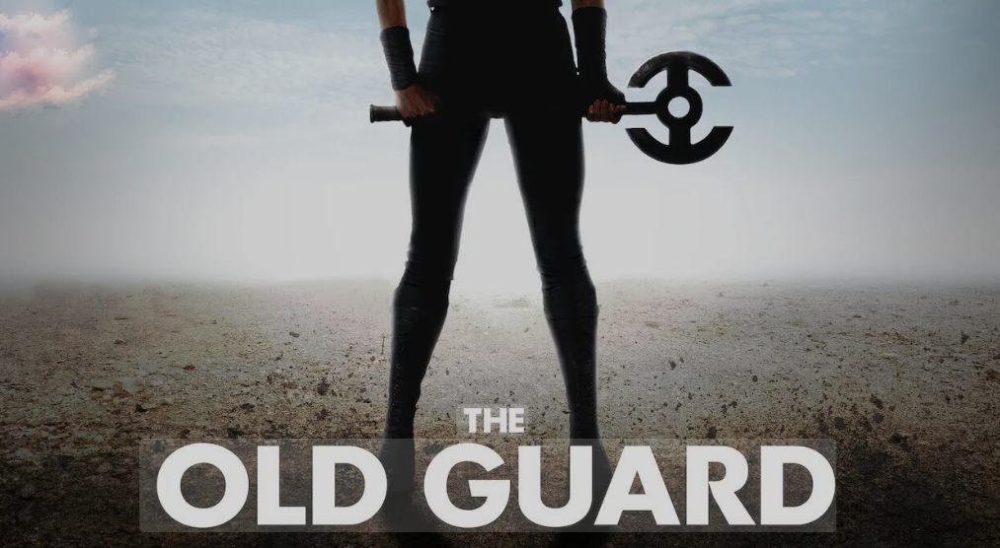

---

author: Ashit Milne
title: Old Guard
date: 2025-10-19
layout: base.njk
draft: False
tags:
- art
- cultural-critique
- political-economy
- environmental-ethics
- monetary-policy
series: Polite Bureau
---

## The Self Preservation Society

I've been a fan of Charlize Theron since *The Italian Job* — a rare remake that surpassed the original (except for obvious nostalgia value) — and I enjoyed *The Old Guard* belatedly. My daughter (the Assassin's Creed aficionado) recommended it to me when it first came out. So when a sequel dropped - a sign these days that a franchise may be worth a looking at— I had one and kept going...

Part 2 sets off in Italy — the picturesque environs of Y-shaped Lake Como, no less — the perfect summer chill vibe on a heat-warning afternoon before some evening yard work. The franchise is a remaking of a timeless myth — one that appears in different forms, but usually revolves around some kind of *order* that seeks to preserve the enduring signal that emanates from ἀρετή (or virtue), or that searches for a talisman (like the Holy Grail): ideas and objects that transcend narrow tribal affiliations and point toward ultimate truth and beauty.

The film is *tastes great, less filling* fun — a bunch of handsome boys fronted by drop-dead (and I mean actually dropping dead and coming back to life, frequently) gorgeous Charlize. What’s not to like? Something to watch while you're messing around a little (giving a foot rub or whatever) with whoever you love hanging with. The film has that element of deeply empathic camaraderie in community and partnership. The fight choreography (some of it Krav) makes me want to get sparring again — that too is above average. It’s a reverse zombie apocalypse, if you will.

Particularly appealing is the idea that constancy in our practice may not yield the insight that we’ve been agents of positive change — but the fact remains, objectively, that we have. It’s an encouraging idea, and it keeps your compass pointed, even when so many others’ seem to spin uncontrollably. There’s a long arc that curves toward good, but it travels in fits and starts — especially because we live on it in real time, unable to zoom out and see the broader scheme. That’s the function of these myths — and the doubt that anguishes the virtuous.

The immortals lose faith — and a mortal friend. A CIA operative Copley (played by Chiwetel Ejiofor) that they work with— traces a ripple effect: a kind of *proof of history* that charts its Merkle Tree route forward in time, beginning with a single kernel — an act of agency ‘to do good’ — whose long-range yield reveals meaning and value as net-positive sum. A couple of examples:

**A man your team saved in 1954 went on to have a child who grew up to become a scientist. That scientist prevented a nuclear disaster in 1978.**

 **A woman the team saved in 1916 went on to found a children’s refuge, which raised someone who became a doctor, who saved thousands during a disease outbreak.**  

Not to be too crassly mercantile about it, but the endeavor is to tighten the ask/bid spread on true value — especially as a way to level the playing field against those granted the advantage of unearned, privileged access to foresight as we travel that long arc. So much the easier, then, to identify the secure nodes around whom we might rally on a more discerning path toward ‘better for more.’ This is a story about values-based staking (committing to) things and people who are worth it (who give and go selflessly).

This is the linearity of faith expressed in the Western traditions — enveloped in time by the cyclicality of our collective manic-depressive swings, with value fluctuating as price in the short term, and over the longer rhythm, as the swing of the *saeculum* and nature’s own pulse, reflected in older pagan and animist traditions.

Andromache of Scythia (Andy) — Theron’s character — reaches back to pagan classical traditions. She is the widow of Trojan prince Hector and represents stoic strength in the face of suffering, persevering through the ages, enduring and prevailing against atrocity.

*The Old Guard* also plays as a clever meditation on the trolley problem. A pharma conglomerate seeks to exploit the proprietary intellectual and material property of a handful of these immortals, who toil thanklessly to save humanity from itself. The company claims it works for the benefit of all — provided, of course, that moats be preserved and IP not shared among competitors (lest it impact revenue). “They’re just too competitive,” goes the rollout excuse.

That these immortals have provably ensured humanity’s survival doesn’t faze the smug, snide, Shkreli-type antagonist — posh, pale, tousled, and cheerfully English this time. The villain seems happy to kill the golden geese, slicing off pieces slowly. The opportunity? More golden eggs, more frequently. Quarterly earnings — and passive shareholders — demand it.

Meanwhile, running throughout the film is the question of value — what is time worth, and what is the price of a life? Does immortality — infinite time — diminish that value, or does it offer the chance to deepen it, by using that life in service of the Commons and, in doing so, safeguarding Creation itself in perpetuity? These are serious questions, and the creators of this franchise have — whether by design or instinct — tapped into a trope with rare resonance for our time. Let’s hope they’re ready for the responsibility, and give us something that continues to deserve our attention. The third installment is set up as a battle between Andy's reluctantly 'humanist' crew and a rival group led by Discord  (played by Uma Thurman) the name implying an alternative to Leer's favourite daughter, Cordelia who is punished for fealty (being the one who chose to keep the cord or bond). Discord sees the excesses of the patriarch and, repulsed, instead rejects that bond outright. She 'cannot unsee the evil' done as she puts it - she is intent on saving Creation  by destroying man so that Creation may return renewed to flourish. Discord believing man to be incurably avaricious would sooner be the salt of the earth (the inanimate mineral richness that feeds Anima *without thought)*, but not without first eviscerating the parasitic cancer that plagues it - humanity. 