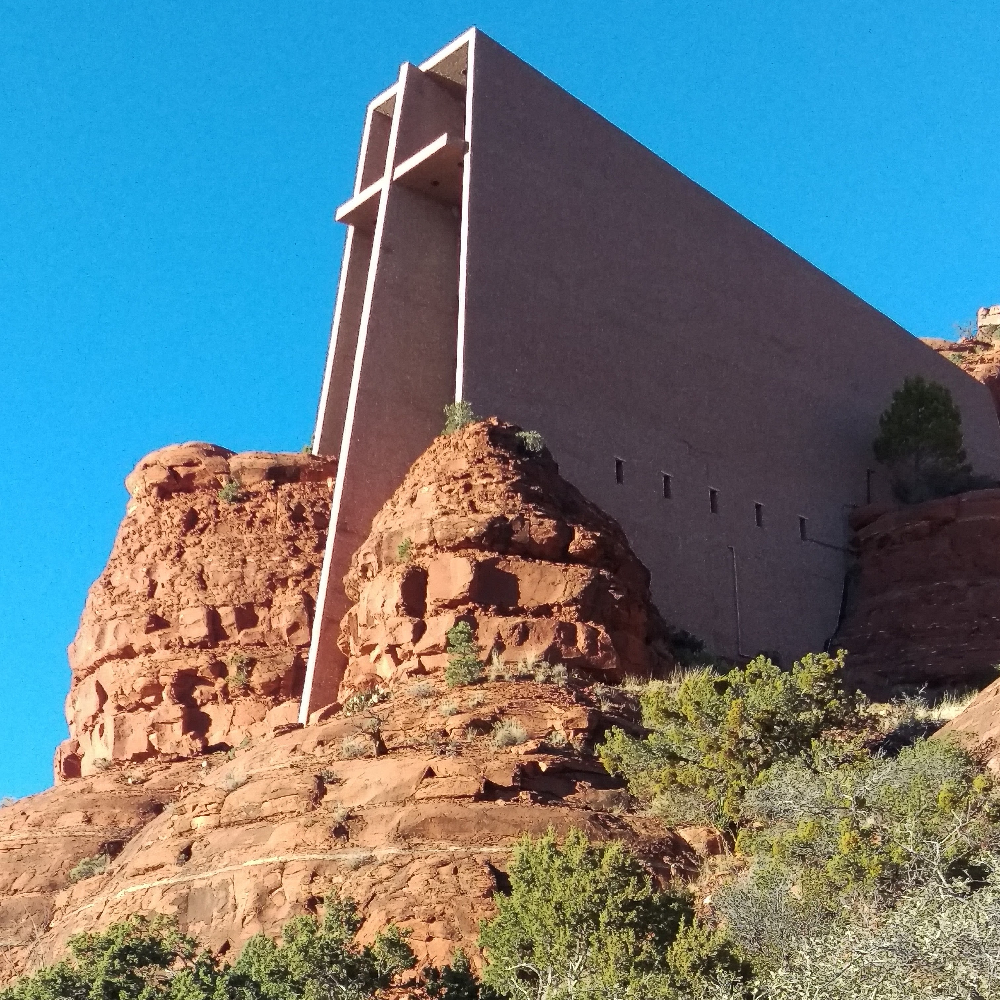

## Introduction ##

This is the first part of *Sine Qua Non* — a series on intelligence, the essential condition without which nothing endures. We stand at the threshold of substantial changes in the way we order civilization, disruptive though ultimately positive in my opinion, as generative artificial intelligence shapes the coming decades. For this intelligence to be meaningful, it must be holistic and systemically valid — in other words, universally legitimate and the possibilities are rich with potential as we learn to harness these already formidable tools to make ourselves responsible and accountable for living our best lives. Kropotkin, the anarchist Russian prince exiled in London aimed to unify existing formal structures of ethics (religion) and the post-colonial pluralistic discourse that both questioned and enhanced those systems. His aim was to create an enduring model of legitimacy capable of instructing and facilitating direct action by a self-sovereign autonomous person in ways reconciled with government and environment. He died before properly attending to that task. That now, with the formidable foundation provided by information technology, is my (admittedly ambitious) objective.

We pivoted from ethical traditions to science in the twentieth century as we examined the anthropological record and understood the universality and the ultimate alignment of our various long-lived traditions. Secularism saw opportunities in science however engineered science was applied with atomic finality by hegemonic power determined to resolve the twentieth century's conflict. For me that means we have no alternative but to evolve *peacefully* towards new models of governance. This is born out by the experience of earnest activists who engaged in armed struggle in the aftermath of the two world wars. Even those who found some success in their national domain saw the limits of their self-determination internationally checked as hegemonic power demanded absolute fealty in the conflict between the two imagined secular faiths - capitalism and communism.

Living my life at the core of western hegemonic power, even born in the heart of its eternal capital London, I am the model of a conflicted favoured son who for fifty years has enjoyed all the trappings of western privilege: a fine education, progressive opportunities for constructive employment, and social connection. It's with a view now to reconcile the best of what I was given with the increasingly complex demands of global legitimacy that I do this work.

I turn for inspiration, as many who possess the spirit of the west, to the natural world where anarchy reigns supreme. As we design systems for human affairs, we may look to an abstract form of biomimicry, gazing at nature and without trying to name or categorize what appears, we may take in the whole of its substance. We will note that in nature, agents are attuned to place and context, continuously transmitting and receiving signals that allow them to coexist in symphonic harmony. The order we perceive is not imposed but emerges - profoundly complex but somehow orderly - in a word anarchic (versus chaotic and haphazard). Higher-order species may still compete for territory and dominance, both across and within collectives. Yet these tensions are balanced by mechanisms that restore equilibrium swiftly so that we scarcely even perceive an imbalance at all. Prey and predator are one and the same while duality is left to night and day. It is less collaboration than it is synergy, less negotiation than symbiosis — a “give and go” of instinctive generosity, an automaticity of shared persistence rather than individual subsistence. 

This first piece explores countervailing ripples - behaviours or habits established in the shadow of atomic science that offset each other because we aim to maximize our take personally in one sphere (poorly because 'more is often less') and then something else that is offered in the public sphere (the commons because the burden of paying for it is shared). We fail to see the connection between them and the potential for betterment through reductive methods. This leave us as profoundly dissatisfied. As individuals we look upon our lives with gaping dissatisfaction, collectively in the form of our governments we struggle with mounting debt. Creation meanwhile has its rhythms and rhymes. Its verse, six times rehearsed, will burn to a cinder our third stone satellite - ever less an Eden worthy of the Sun's sweetness and light.

## Deus Ex Machina ##

>*For to everyone who has, more will be given, and he will have abundance, but from the one who has not, even what he has will be taken away.* Matthew 25:29 

>Dear God, hope you get the letter, and-
I pray you can make it better down here
I don't mean a big reduction in the price of beer
But all the people that you made in your image
See them starving on their feet
'Cause they don't get enough to eat from God
I can't believe in you

>Dear God, sorry to disturb you, but-
I feel that I should be heard loud and clear
We all need a big reduction in amount of tears
And all the people that you made in your own image
See them fighting in the street
'Cause they can't make opinions meet about God
I can't believe in you

>Did you make disease and the diamond blue?
Did you make mankind after we made you
 ~ XTC (Dear God)  

God speaks to human beings through many vectors…but nowhere with such detail and grace and joy as through creation - when we destroy nature we diminish our capacity to sense the divine - Robert F. Kennedy Jr.

In a conversation with long-form podcast creator Lex Fridman, Kennedy who as I write occupies the Health file in the second Trump Administration goes on to talk about Jung's reconciliation of faith and science and experiences of ‘synchronicity’ - the proliferation of happenstance or coincidence that occurs in some lives such that, say, even a hardcover opened at a random page or practically any show you watch infers some truth; it’s God tapping us on the shoulder. God is consciousness itself - we are in the mind of God, says Mr. Kennedy. The rational will object that patterns naturally appear when one is determined to see them - we look for what we *want* to see. But it is a reasonable idea nevertheless that we are a connected. Even at an atomic level odds are that you contain or once did, at any rate, a particle from every fauna and flora that ever was. Our genetic code is virtually identical the variances mere rounding errors. So it's extraordinary how disparate our priorities and worldviews are.  Yet we share a zeitgeist and the most compelling narratives played out at large in the world are trenchant echoes or *currents* of our most enduring and cherished distilled legacy - those expressed in the great works of our wisdom teachers and taught by grandmothers the world over in plain spoken common sense. The essential strands of thoughts that carry our collective on this orb are carried by ones who express through action that clarified truth. Clarity that burns clean like ghee in times when even wholesome butter's opacity is cause to suspect its purity and value at *any* price.

*The Universal Substance is docile and ductile and the Reason that controls it has no motive in itself to do wrong. For it hath no wrongness and doeth no wrong, nor is anything harmed by it. But all things come into being and fulfil their purpose as it directs.*

~ Marcus Aurelius, Book VI: 1

Mr. Kennedy, an accomplished attorney practiced in Environmental Law comes with an inspiring story of personal redemption. To me he looked in 2023 every bit like the model American leader the rest of the world craved in his putative bid for the Democratic nomination.

He seeks organic and earthy solutions to what ails us and would sooner get to the root and heart of the matter than fiddle and nitpick around the edges. In an age when people tire of having their collective identity (be it country or political philosophy) used to sell conflict at home and abroad, he offers a modern, humanist echo of the question posed by his uncle 'Ask not what your country can do for you-ask what you can do for your country'. John Kennedy's quiet addendum was answered in action with the Peace Corps - a substantive manifestation of Tom Paine's refrain 'the world is my country, to do good is my religion'. In the post-imperial era, it was a suitable follow-up to the Marshall Plan, and America's equitable and democratic response to the Suez Crisis. All striking the right notes even as discordant ones rained on Persia, Latin America, and of course Vietnam - almost as though America sought to split the difference between 'open' markets and to 'free' people.

## L'etat Est Moi ##

> When I am king
 You will be first against the wall
 With your opinion
 Which is of no consequence at all
~ Radiohead (Paranoid Android)

To free people has come to mean to affect Democracy which seeks nothing if not to quell scarcity in our world as a foundation for subsequent layers of self-actualization. Nietzsche claimed we killed God. What he meant was that through science, and democracy - a process by which we reach consensus on *how* we do what we do, we came to believe we were capable of harnessing the power of creation and through it to manufacture abundance for all. But if take an honest look 

Now personally drilling into this question of what abundance amounted to I started by looking around me and examining the things I had and what would happen as I started peeling them away. Invariably life became simpler. There was more space and time. This too was the case with my activity. My work - did it still offer an opportunity for growth? Was there some marginal utility to be gotten from it - something new beyond the paycheque? As a project manager in the digital identity, wallet and content space I had gleaned everything I needed and the answer was increasingly no; so I pivoted to this work - building and supporting the spaces that align with my own values and objectives.

I once also spent a considerable amount of time managing my personal investments - with success until around 2010. From then until around 2018 I traded - mostly to learn about risk and volatility in financial markets. Then with the emergence of proof of stake I bailed fiat entirely and simply staked my capital. Again leaving me me with lots of time. This I spent investing in myself; restoring my practices for self-care and coming back to my best instincts for wellness and instilling my life with creativity aligned with my natural inclinations and accumulated abilities, which is where this work. The outcome, with a few minor quibbles, is my best life - a purple patch of pretty much pure satisfaction. 

What I have done essentially is 'fork' or separate from the typical life of a man and affected autonomy or autocracy of the self. Something which most choose not to do. I have become self-sovereign and made myself responsible for outcomes in my life versus say, a boss, company or pension fund. Reinforcing this bailed also bailed on the reactionary noise that demands you stay vested in the world as it is - LinkedIn and other social media. It's as though I became King of myself and then lined up and shot those dissidents within me that were captured by the world without with its poverty of imagination against what creation and creativity demanded.

## The World Without and Its Manufactured Poverty ##

The things that ail us is that we demand that the very things that nature demands remain scarce be made abundant. We refuse to obey creation. Again, we have killed God precisely so that we do not have to obey hymn. 

Take the obvious: salt, sugar, and fat - the stuff that throughout the ages actually constituted forms of money. The word salary is even derived from salt. Like money these things are best used as nature intended; thoughtfully and without too much accumulation within or without the body. Creation demands that they be consumed only after expending considerable effort in procuring them and possessing the patience and self-awareness to know the difference between literal hunger and uncontrolled impulse.

It isn't enough that our selective careful breeding of various crop and chattel was in order to derive a better marrow (and bone marrow)  if we could only bring ourselves to pay the salt of the earth farmer a fair price for it. Instead we prefer to manufacture synthetic proxies for a faster workflow and quickly delivered product. Speed equals high-frequency retail equal high-frequency revenue. Our wont is to make things ever so slightly worse, tolerably  so, that we might have more of it all day so that an ever larger number of us might earn, ironically, 'a living'. Now none this is to say we need to be arseholes about this. In a social context  be the guy that says 'yes' when someone offers you cake especially if you don't even want it - it's called being gracious. Let's enjoy our slice of pizza or butter tart - aren't they so much better the less frequently relished? And as well, after a long day of hiking cross-country to a lake with a good friend or two, gazing into a fire, flask of single malt whisky in hand, lighting up a cigarette is the most obvious, sensible and manifestly intelligent thing to do. At such moments, in this (Haudenosaunee) country, it amounts to receiving sacrament.

The debate Mr. Kennedy has joined on fluoride is a case in point. He doesn't *per se* question the efficacy of fluoride as a preventative for cavities (the science speaks plainly on this) but poses the *unspoken* question 'why cavities?' Or by extension 'why obesity?' And hence, why diabetes and the subsequently spiraling costs keeping the sick well enough to function but not truly in convalescence, rehabilitation or recovery? Why fluoride when *via negativa* we might affect a solution, each of us at the root by adopting a more wholesome diet and lifestyle while the government explores ways to incentivize such behaviour perhaps funded with capital released from downstream kluges such as fluoride - it's still there in industrially to manufactured toothpaste after all if you want it. (I make my own with coconut oil, baking soda and peppermint extract.)

Now I don't for a minute suggest there isn't a place for the artificial and synthetic. As an outdoors enthusiast I revel in my long-lasting carbon fibre, nylon, acrylic and other plastics put to good form and function in ultra light gear but when it comes to food I prefer to carry the real thing into creation.  

## Creature Comforts ##

Regardless of religious tradition, anyone truly *being* in the midst of creation - on a mountain top before snowboarding it or looking out onto a lake in the deep stillness of the backcountry is apprehending the natural peace, order and good government of anarchy. No constant gardener is required to tend and maintain these spaces. Even the trails are well worn by bears, wolves, foxes, moose and deer and they carve a sensibly efficient path through the backcountry terrain. No discernible architect is required to inspect and certify this space. All of creation's structures are stable and it's voice is always sound - signal that is never noise. 

The Church of the Holy Chapel above appears at one with its surrounding - as though it emanates as a source of truth (*satya*) and beauty (*sundar*) from the planet itself. It moves you; a former colleague and dear friend of mine related how he spontaneously wept in its pews as he recognized an unknowable holistic eminence; I saw my wife do the exact same thing when we were there - spontaneously and suddenly weep with catharsis. Frank Lloyd Wright's masterpiece is timeless in form and function as a space for introspection. It *somehow* expressing the un-expressible. For me, that cross of Lloyd Wright's Holy Chapel appearing to rise from the planet marks the ascent of the self, the horizontal a measure marked against a vertical metric derived from a consensus of what constitutes worthy achievement in the company of Lucifer, the descended angel and the light-giver. It is something more than most are even allowed to dream of and achieved *in luce maxima*. A man too must know humility: he is not the sum of all the capital neither in letter nor spirit - the Promethean grab is beyond him and he should know it lest in his vanity he deigns to become Lucifer himself. He is not the whole of the capital that is notional truth and beauty. He is not the source of creation. He is the son — merely a hopeful successor to the Father, and an aspiring emanation of the Holy Spirit - and that too only if he dares to be creative enough to justify his existence. 

In God’s anarchy, I carry a Bic lighter or two for lighting deadwood for warmth and comfort, but also a ferrous stick (just in case) as a primordial reminder, literally brimstone, of the power entrusted to us and our responsibility to create good things with it.

In our ordinary runabout life in society, it's the same unspoken sense of what constitutes peace and order that has us queue quietly at the bus stop without being told - each arriving and waiting in turn. Impatient though we may be, none is looking to get an advantage on our fellow traveller. We rebel like roundheads against the over-reach of authority that seeks to direct our romantic traffic with lights that turn red at desolate stops in the middle of the night and stay that way for a seemingly interminable wait. Even in midday traffic at junctions with routes of varying weights of traffic, how much less arbitrary is that analog of  a node the roundabout with its natural ebb and flow, give and go and so much more demanding of its users for their awareness and wakefulness. Almost all people introduced to liberty and the opportunity to direct their own affairs are then loath to give them up - and it's why as a species we have travelled a long arc that leans into equity, autonomy, and justice. In theatre, the gods swoop to solve a hero's problems in a convenient (but often unbelievable) way; it's called *Deus ex Machina* and. We bring the divine to the matter when we attend to our affairs private and collective with full engagement. That's essentially idea in the greeting *Namaste* and it's how we will put God into the collective machine that is us - by encapsulating that knowledge that is our distilled spirit - ourself at our best more often whether in private or public.
